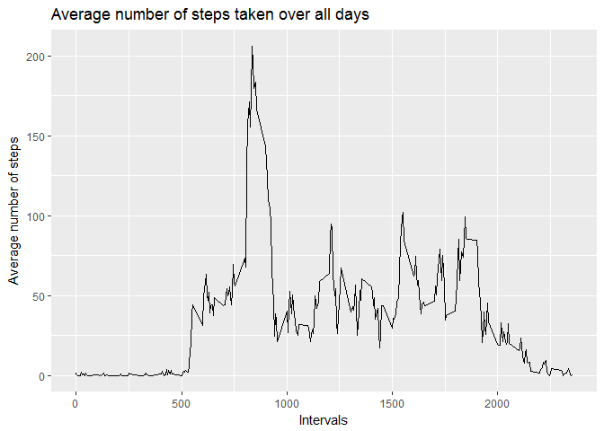
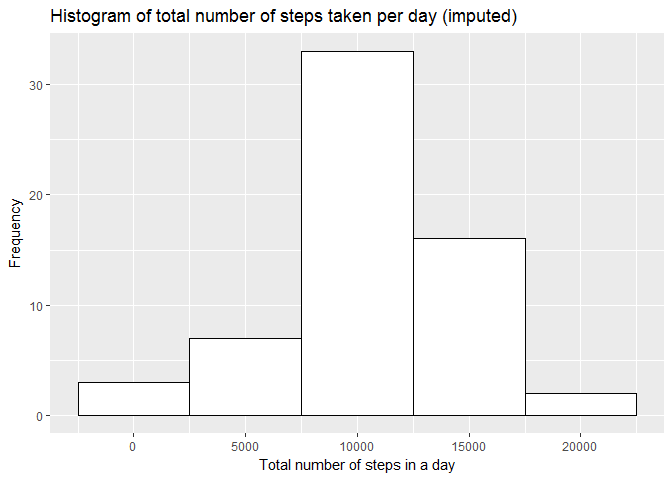

## Assignment details

This assignment makes use of data from a personal activity monitoring device. This device collects data at 5 minute intervals through out the day. The data consists of two months of data from an anonymous individual collected during the months of October and November, 2012 and include the number of steps taken in 5 minute intervals each day.

The data can be found at: https://d396qusza40orc.cloudfront.net/repdata%2Fdata%2Factivity.zip

This assignment is meant to be completed in five separate steps:

* Loading and preprocessing the data
* What is mean total number of steps taken per day?
* What is the average daily activity pattern?
* Imputing missing values
* Are there differences in activity patterns between weekdays and weekends?

Before kicking off to these tasks, there are a few libraries that are needed later: dplyr, ggplot2, and timeDate.


```r
library(dplyr)
library(ggplot2)
library(timeDate)
```

*Please note, that the messages and warnings were set off for this chunk, since the loading messages and warnings are useless in this context.*

## Loading and preprocessing

First up, the data is read into a variable called *activity*, and the empty values (NA) are "cleaned" away, and the data without missing values is set into the variable *clean_act*. This is done in order to use the data without missing values  for the initial part of this assignment and allow comparison with the latter part.


```r
activity <- read.csv("activity.csv")
clean_act <- activity[complete.cases(activity), ]
```

Moving on.

## What is mean total number of steps taken per day?

First order of business is to determine the total number of steps taken per day. This is done with aggregate()-function, taking a sum of the data per day. Plus changing the column names after the aggregation.


```r
total_steps <- aggregate(clean_act[, 1], list(clean_act$date), sum)
colnames(total_steps) <- c("Date", "Total")
```

To show the total steps per day, a histogram is drawn using ggplot2.


```r
qplot(total_steps$Total, 
		geom="histogram", 
		binwidth=5000,
		main="Histogram of total number of steps taken per day",
		xlab="Total number of steps in a day",
		ylab="Frequency",
		fill=I("white"),
		col=I("black"))
```

<!-- -->

And lastly, the mean and median of the total steps, as the answer to the question.


```r
summary(total_steps)
```

```
##          Date        Total      
##  2012-10-02: 1   Min.   :   41  
##  2012-10-03: 1   1st Qu.: 8841  
##  2012-10-04: 1   Median :10765  
##  2012-10-05: 1   Mean   :10766  
##  2012-10-06: 1   3rd Qu.:13294  
##  2012-10-07: 1   Max.   :21194  
##  (Other)   :47
```
**The mean: 10766, and the median: 10765.**  

## What is the average daily activity pattern?

For this question, the first task is to determine the means for each time of day, as in for each 5-minute sequences. Using the same strategy than before, just changing sum to mean in the aggregate(), the average steps per interval are determined. 

```r
total_intervals <- aggregate(clean_act[, 1], list(clean_act$interval), mean)
colnames(total_intervals) <- c("Interval", "Average")
```

To hammer the point down, here's a time series plot showing the average activity for each interval.


```r
qplot(total_intervals$Interval, 
	total_intervals$Average, 
	geom="line",
	main="Average number of steps taken over all days",
	xlab="Intervals",
	ylab="Average number of steps")
```

<!-- -->

The highest activity interval is somewhere between 750 and 1000 minutes, and the exact point is...  


```r
total_intervals[total_intervals$Average == max(total_intervals$Average), ]
```

```
##     Interval  Average
## 104      835 206.1698
```

**Interval 835, with the mean of 206.1698.** 

## Imputing missing values

As mentioned before: *Note that there are a number of days/intervals where there are missing values (coded as NA). The presence of missing days may introduce bias into some calculations or summaries of the data.*

So for this part, the original data will be used, from variable *activity*.

First, there is exactly this many NAs in the data:


```r
sum(is.na(activity))
```

```
## [1] 2304
```

Instead of omitting the NAs, they will be replaced with the interval mean calculated in the previous section. While not elegant, it works. Note that the original data is copied into *new_act* for further use.


```r
new_act <- activity
for(i in 1:nrow(new_act)) {
	if(is.na(new_act$steps[i])) {
		interval_value <- new_act$interval[i]
		step_value <- total_intervals[total_intervals$Interval == interval_value, ]
		new_act$steps[i] <- step_value$Average
	} 
}
```

In order to show the difference this act gave, the process is similar to before to prepare the data for comparison.


```r
new_steps <- aggregate(new_act[, 1], list(new_act$date), sum)
colnames(new_steps) <- c("Date", "Total")
```

To demonstrate the change these actions brought, a new histogram will be drawn, with same specs as before. 


```r
qplot(new_steps$Total, 
	geom="histogram", 
	binwidth=5000,
	main="Histogram of total number of steps taken per day (imputed)",
	xlab="Total number of steps in a day",
	ylab="Frequency",
	fill=I("white"),
	col=I("black"))
```

<!-- -->

And how much did the mean and median get affected?


```r
summary(new_steps)
```

```
##          Date        Total      
##  2012-10-01: 1   Min.   :   41  
##  2012-10-02: 1   1st Qu.: 9819  
##  2012-10-03: 1   Median :10766  
##  2012-10-04: 1   Mean   :10766  
##  2012-10-05: 1   3rd Qu.:12811  
##  2012-10-06: 1   Max.   :21194  
##  (Other)   :55
```

**Median went from 10765 to 10766, while the mean was not affected (10766).** What did change were the 1st Quantile (from 8841 to 9819) and 3rd Quantile (from 13294 to 12811). The total number of steps per day were more focused towards the center of the histogram, and closer to the median.

## Are there differences in activity patterns between weekdays and weekends?

In order to make a difference between weekdays and weekends, using the dates, a new factorized variable is added to the data. 


```r
new_act$weekdays <- factor(isWeekday(as.Date(new_act$date)), levels=c(TRUE, FALSE), labels=c("weekday", "weekend"))	
```

Then the data is again aggregated to produce a mean of steps in relation to the interval and the type of day. Column names are set just because they were set before as well.


```r
new_intervals <- aggregate(steps ~ interval + weekdays, new_act, mean)
colnames(new_intervals) <- c("Interval", "DayType", "Average")
```

Finally, a panel plot that shows the differences during weekends and weekdays.


```r
p <- ggplot(new_intervals, aes(Interval, Average)) + geom_line()
p + facet_grid(DayType ~ .) + labs(y="Average number of steps")
```

<!-- -->

Apparently on weekdays the activity is emphasized towards the mornings, while on weekends it's largely staying somewhat even around the day.
